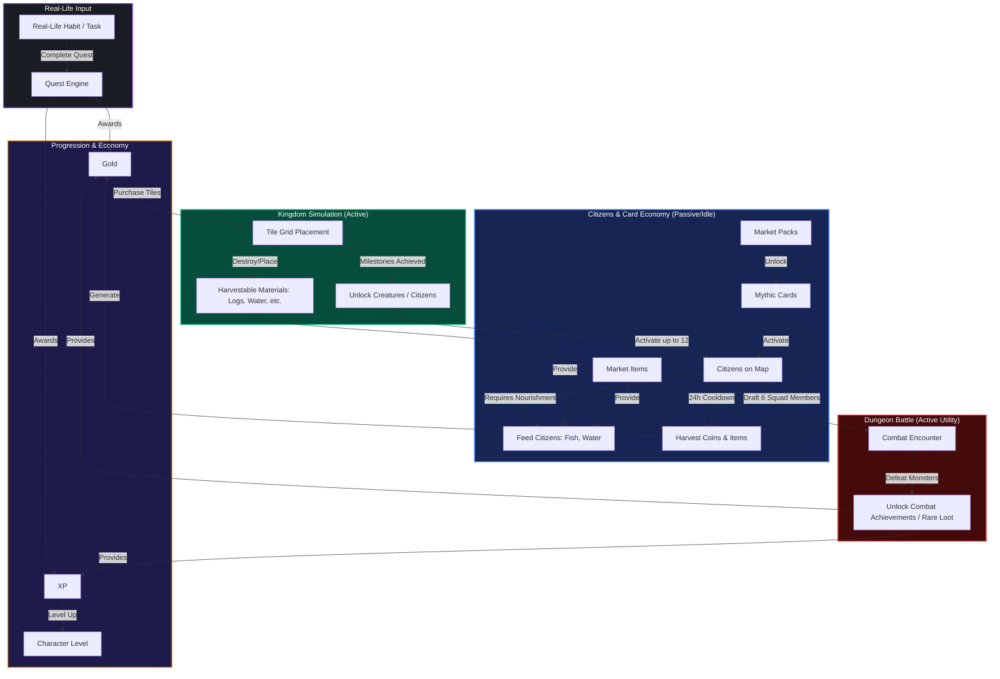

# Game Architecture & Core Loop Workflow

This document details how the real-life productivity habits, active kingdom simulation, passive idle citizens, card collections, and turn-based combat systems operate together as a single, unified gamification loop.

---

## 1. High-Level System Architecture

---

## 2. Core Gameplay Loops

### A. The Primary Hook: Real-Life to Gold & XP
1. **Input**: The player performs real-life self-improvement habits (e.g., studying, exercising, reading).
2. **Action**: Completes associated Quests/Tasks in the daily hub.
3. **Reward**: Earns **XP** (character growth) and **Gold** (gameplay currency).

### B. The Active Gameplay Loop: Kingdom Placement & Discoveries
1. **Action**: The player spends earned **Gold** to buy land tiles (Forest, Mountain, Water, Ice, Snow).
2. **Construction**: Places tiles on the realm map. Roads and infrastructure can be rotated/connected.
3. **Discovery**: Reaching specific tile counts triggers milestones, unlocking new species (e.g., placing 5 water tiles triggers the achievement unlocking **Divero**).
4. **Material Generation**: Forest and Water tiles slowly produce materials (e.g., wood logs, clean water).

### C. The Passive/Idle Loop: Citizen Nourishment
1. **Activation**: Discovered creatures are set as active **Citizens** wandering the map (up to 12).
2. **Nourishment**: Citizens require feeding (e.g., Red Fish from inventory, Water from tile collections) to stay active.
3. **Passive Harvest**: Every 24 hours, healthy, active citizens generate a passive gold output and random material bundles, which the player harvests to feed back into the Gold loop.

### D. The Collectible Card Engine: Mythic Cards
1. **Action**: Spending Gold on booster packs in the Market.
2. **Opening**: Opening packs unlocks rare, variants of cards (with holographic/color variants).
3. **Citizen Integration**: Mythics can be deployed as Citizens on the map, boasting higher base passive gold generation rates and rarer drop tables.

### E. The Active Battle Loop: Dungeon Crawling
1. **Preparation**: Draft a squad of up to 6 unlocked citizens/creatures.
2. **Adventure**: Battle monsters in dungeon rooms. Active fighters take damage; fainted characters must be swapped for survivors.
3. **Combat Drops**: Defeating dungeon challenges rewards gold, high-tier consumables (food/potions), and combat achievements.

---

## 3. Psychological Retention Anchors

| System | Psychological Driver | Game Realization |
| :--- | :--- | :--- |
| **Habit Engine** | Immediate gratification | Real-life tasks yield instantly spendable gold coins and visual level-ups. |
| **Kingdom Grid** | Ownership & Creativity | Placing and designing a personalized realm map gives visual permanence to hard work. |
| **Citizens** | Nurturing & Loss Aversion | Feeding virtual companions triggers daily responsibility; neglecting them pauses resource gains. |
| **Booster Packs** | Variable Rewards (Gacha) | Opening card packs satisfies collection desires and offers chance highlights. |
| **Dungeons** | Competence & Challenge | Assembling squads to overcome combat rooms validates the player's unlocked rosters. |
